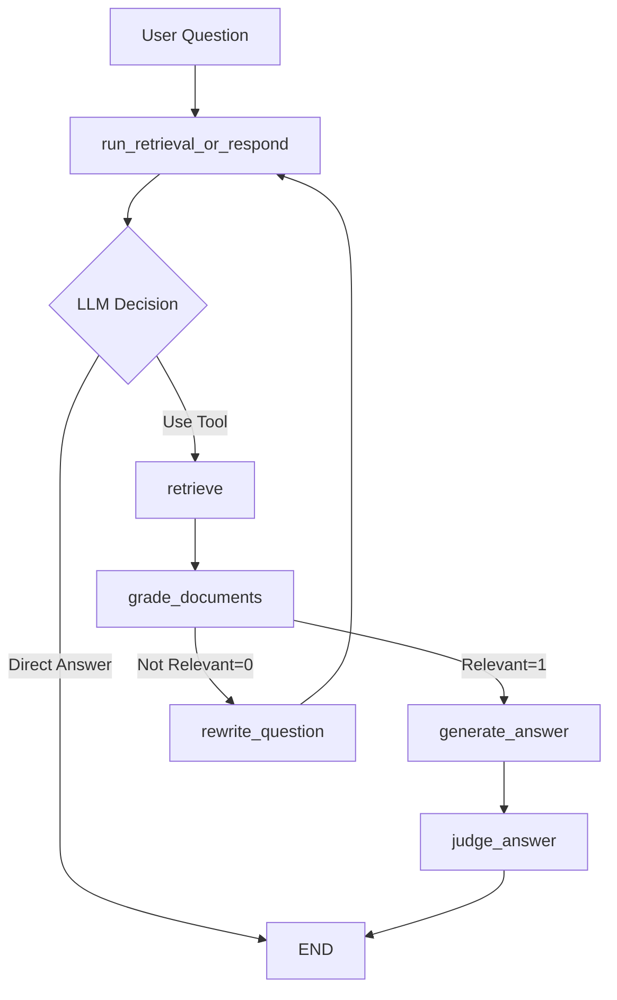

# ai-agent-med

A Retrieval-Augmented Generation (RAG) system for querying patient medical data. This is an example to show limitations of RAG system in complex domains like healthcare.

## Setup

1. **Install Dependencies**
   ```bash
   python -m venv .venv
   source .venv/bin/activate  # On macOS/Linux
   pip install -r requirements.txt
   ```

2. **Configure OpenAI API Key**
   ```bash
   cp .env.template .env
   # Edit .env and add your OpenAI API and other keys
   ```

3. **Run the System**
   ```bash
   python medical_rag_components.py
   ```

## Data Structure

The system expects medical data in the `data/` directory with the following structure:
```
data/
  patient_id/
    intake.md
    medications.md
    genetics/
      genetics.md
    imaging/
      *.md
    labs/
      *.md
```

## Graph Flow

The system uses LangGraph to orchestrate a multi-step workflow for processing medical queries:



### Flow Description:

1. **Initial Decision** (`run_retrieval_or_respond`): The LLM decides whether to retrieve medical documents or respond directly
2. **Document Retrieval** (`retrieve`): If retrieval is needed, searches patient records using vector similarity
3. **Document Grading** (`grade_documents`): Evaluates if retrieved documents are relevant to the question
4. **Question Rewriting** (`rewrite_question`): If documents aren't relevant, rewrites the question with medical terminology
5. **Answer Generation** (`generate_answer`): Creates a medical answer using relevant retrieved context
6. **Answer Judging** (`judge_answer`): Evaluates answer quality against golden reference answers

### Key Features:
- **Smart Routing**: Only retrieves documents when necessary
- **Quality Control**: Grades document relevance before proceeding
- **Iterative Refinement**: Rewrites questions if initial retrieval fails
- **Evaluation**: Judges final answers for medical accuracy and completeness

## Example Output

### Rewritten Questions
```sh
((.venv) ) (base) umermansoor@Umers-MacBook ai-agent-med % python medical_rag_agent.py
✅ Environment variables loaded successfully

� Original Question: 'does the patient have diabetes?'
🔄 Improved Question: 'Based on the patient's laboratory results, specifically the hemoglobin A1C levels and fasting blood glucose measurements, is there evidence to support a diagnosis of diabetes mellitus? Additionally, are there any current medications or clinical findings that indicate management of diabetes?'

� Original Question: 'list the patient's current medications'
🔄 Improved Question: 'Could you provide a detailed list of the patient's current pharmacological treatments, including all prescribed medications and over-the-counter supplements, along with their respective dosages and indications?'

� Original Question: 'the person reported feeling fatigued and weak. what could be the cause?'
🔄 Improved Question: 'Considering the patient's reported symptoms of fatigue and weakness, what laboratory abnormalities, such as anemia, electrolyte imbalances, or thyroid dysfunction, could be contributing to these clinical findings? Additionally, are there any current medications or supplements that might be causing these symptoms as side effects?'

� Original Question: 'what's the health status of the patient?'
🔄 Improved Question: 'Could you provide a comprehensive overview of the patient's current health status, including recent laboratory results, current medications and dosages, imaging study findings, and any relevant genetic information?'
```

### Example Answer
```sh
((.venv) ) (base) umermansoor@Umers-MacBook ai-agent-med % python medical_rag_agent.py
/opt/homebrew/Cellar/python@3.12/3.12.10_1/Frameworks/Python.framework/Versions/3.12/Resources/Python.app/Contents/MacOS/Python: can't open file '/Users/umermansoor/Documents/GitHub/ai-agent-med/medical_rag_agent.py': [Errno 2] No such file or directory
((.venv) ) (base) umermansoor@Umers-MacBook-Pro-2 ai-agent-med % python medical_rag_components.py 
✅ Environment variables loaded successfully
📚 Loaded 12 medical documents
📝 Split into 59 chunks
🔍 Creating embeddings and vector store...
📊 Retriever configured to return top 3 most relevant chunks
✅ Retrieval tool ready

� Original Question: 'what prescription medications is the patient taking?'


🔄 Improved Question: 'Could you provide a detailed list of the patient's current prescription medications, including the drug names, dosages, and indications for use?'


📊 Retrieved 3 document chunks


📄 Combined Context: ## Prescription Medications

---

## Medications (Current)  
- Levothyroxine 75 mcg once daily  
- Atorvastatin 20 mg nightly  
- Aspirin 81 mg daily  
- Vitamin D3 2000 IU daily  
- Calcium Citrate 5...


⚖️ Grader Decision: generate_answer


🏥 Medical Answer: The patient's current prescription medications include Levothyroxine 75 mcg once daily for thyroid hormone replacement, Atorvastatin 20 mg nightly for hyperlipidemia management, and Aspirin 81 mg daily for cardiovascular prophylaxis. Additionally, the patient takes Vitamin D3 2000 IU daily and Calcium Citrate 500 mg twice daily for bone health, Omega-3 Fish Oil 1000 mg twice daily for cardiovascular support, and a daily multivitamin for general health maintenance.
```

## Enhanced Features

### ID-Based Question Matching
The system now supports precise question identification using unique IDs:

```bash
python medical_agent.py  # Uses improved ID-based judge matching
```

- **Precise Matching**: Questions identified by IDs (`fatigue_001`, `diabetes_001`) instead of text matching
- **Better Evaluation**: More reliable judge scoring using structured question database
- **Backward Compatible**: Falls back to text-based matching for legacy questions

See `README_ID_SYSTEM.md` for detailed information about the enhanced ID-based system.

## Files

- `medical_agent.py` - Main LangGraph workflow
- `retriever.py` - Document retrieval with ChromaDB
- `grader.py` - Document relevance scoring
- `rewriter.py` - Question rewriting for better retrieval
- `generate_answer.py` - Medical answer generation
- `judge_answer.py` - Answer quality evaluation
- `custom_state.py` - Enhanced state schema with question IDs
- `question_id_manager.py` - Question ID management utilities